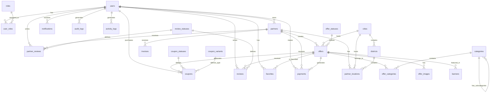

# Schemat Bazy Danych Pedro.pl

## Przegląd

Baza danych Pedro.pl wykorzystuje PostgreSQL (Supabase) z kompleksowym schematem obsługującym promocje, użytkowników, partnerów, kupony i wszystkie powiązane funkcjonalności. Baza jest już utworzona i gotowa do integracji z aplikacją.

## Status Implementacji

✅ **Baza danych jest już utworzona w Supabase**
- Wszystkie tabele są zdefiniowane
- Relacje są ustanowione
- Schemat jest gotowy do użycia
- Wymaga tylko integracji z aplikacją Next.js

## Diagram ERD



## Tabele Główne

### 1. users
Przechowuje dane wszystkich użytkowników platformy (klienci, partnerzy, administratorzy).

```sql
CREATE TABLE users (
  id UUID UNIQUE PRIMARY KEY NOT NULL,
  email VARCHAR UNIQUE NOT NULL,
  password_hash VARCHAR,
  first_name VARCHAR,
  last_name VARCHAR,
  created_at TIMESTAMP,
  updated_at TIMESTAMP,
  deleted_at TIMESTAMP
);
```

**Kluczowe pola:**
- `id` - UUID użytkownika (kompatybilne z Supabase Auth)
- `email` - unikalny adres email
- `password_hash` - zahashowane hasło
- `deleted_at` - soft delete

**RLS (Row Level Security):**
- Użytkownik może przeglądać/edytować tylko swoje dane
- Admin może przeglądać wszystkich użytkowników

### 2. roles & user_roles
System ról użytkowników (USER, PARTNER, ADMIN).

```sql
CREATE TABLE roles (
  id INT UNIQUE PRIMARY KEY NOT NULL,
  name VARCHAR UNIQUE NOT NULL
);

CREATE TABLE user_roles (
  id INT UNIQUE PRIMARY KEY NOT NULL,
  user_id UUID REFERENCES users(id),
  role_id INT REFERENCES roles(id)
);
```

### 3. partners
Dane firm/partnerów oferujących promocje.

```sql
CREATE TABLE partners (
  id INT UNIQUE PRIMARY KEY NOT NULL,
  user_id UUID REFERENCES users(id),
  name VARCHAR,
  description TEXT,
  logo_url VARCHAR,
  verified BOOLEAN,
  created_at TIMESTAMP,
  updated_at TIMESTAMP,
  deleted_at TIMESTAMP,
  custom_fields JSONB
);
```

**Kluczowe pola:**
- `user_id` - właściciel firmy
- `verified` - czy firma jest zweryfikowana
- `custom_fields` - dodatkowe dane w formacie JSON

### 4. offers
Oferty promocyjne dostępne na platformie.

```sql
CREATE TABLE offers (
  id INT UNIQUE PRIMARY KEY NOT NULL,
  partner_id INT REFERENCES partners(id),
  title VARCHAR,
  description TEXT,
  price_original DECIMAL,
  price_discounted DECIMAL,
  discount_percent DECIMAL,
  start_date DATE,
  end_date DATE,
  status_id INT REFERENCES offer_statuses(id),
  city_id INT REFERENCES cities(id),
  address VARCHAR,
  lat DECIMAL,
  lng DECIMAL,
  created_at TIMESTAMP,
  updated_at TIMESTAMP,
  limit_coupons INT,
  deleted_at TIMESTAMP,
  custom_fields JSONB
);
```

**Kluczowe pola:**
- `price_original`, `price_discounted` - ceny przed i po rabacie
- `limit_coupons` - limit kuponów do sprzedaży
- `status_id` - status oferty (aktywna, wstrzymana, zakończona)

### 5. coupons
Kupony zakupione lub pobrane przez użytkowników.

```sql
CREATE TABLE coupons (
  id INT UNIQUE PRIMARY KEY NOT NULL,
  offer_id INT REFERENCES offers(id),
  user_id UUID REFERENCES users(id),
  code VARCHAR UNIQUE NOT NULL,
  status_id INT REFERENCES coupon_statuses(id),
  variant_id INT REFERENCES coupon_variants(id),
  purchased_at TIMESTAMP,
  used_at TIMESTAMP,
  expires_at TIMESTAMP,
  price_at_purchase DECIMAL,
  discount_percent_at_purchase DECIMAL,
  offer_snapshot JSONB,
  deleted_at TIMESTAMP
);
```

**Kluczowe pola:**
- `code` - unikalny kod kuponu
- `offer_snapshot` - snapshot oferty w momencie zakupu
- `status_id` - status kuponu (aktywny, wykorzystany, wygasły)

### 6. categories
Kategorie ofert (np. Jedzenie, Uroda).

```sql
CREATE TABLE categories (
  id INT UNIQUE PRIMARY KEY NOT NULL,
  name VARCHAR,
  slug VARCHAR,
  parent_id INT REFERENCES categories(id),
  created_at TIMESTAMP,
  updated_at TIMESTAMP,
  deleted_at TIMESTAMP
);
```

**Hierarchia:**
- Obsługuje kategorie i podkategorie przez `parent_id`

### 7. payments
Płatności za kupony.

```sql
CREATE TABLE payments (
  id INT UNIQUE PRIMARY KEY NOT NULL,
  user_id UUID REFERENCES users(id),
  coupon_id INT REFERENCES coupons(id),
  offer_id INT REFERENCES offers(id),
  partner_id INT REFERENCES partners(id),
  amount DECIMAL,
  status VARCHAR,
  payment_method VARCHAR,
  payment_provider VARCHAR,
  created_at TIMESTAMP,
  deleted_at TIMESTAMP
);
```

### 8. reviews & partner_reviews
System recenzji dla ofert i partnerów.

```sql
CREATE TABLE reviews (
  id INT UNIQUE PRIMARY KEY NOT NULL,
  offer_id INT REFERENCES offers(id),
  user_id UUID REFERENCES users(id),
  rating INT,
  comment TEXT,
  status_id INT REFERENCES review_statuses(id),
  created_at TIMESTAMP,
  deleted_at TIMESTAMP
);

CREATE TABLE partner_reviews (
  id INT UNIQUE PRIMARY KEY NOT NULL,
  partner_id INT REFERENCES partners(id),
  user_id UUID REFERENCES users(id),
  rating INT,
  comment TEXT,
  status_id INT REFERENCES review_statuses(id),
  created_at TIMESTAMP,
  deleted_at TIMESTAMP
);
```

### 9. favorites
Ulubione oferty i partnerzy użytkowników.

```sql
CREATE TABLE favorites (
  id INT UNIQUE PRIMARY KEY NOT NULL,
  user_id UUID REFERENCES users(id),
  offer_id INT REFERENCES offers(id),
  partner_id INT REFERENCES partners(id),
  created_at TIMESTAMP,
  deleted_at TIMESTAMP
);
```

### 10. cities & districts
Miasta i dzielnice dla lokalizacji.

```sql
CREATE TABLE cities (
  id INT UNIQUE PRIMARY KEY NOT NULL,
  name VARCHAR,
  created_at TIMESTAMP,
  updated_at TIMESTAMP,
  deleted_at TIMESTAMP
);

CREATE TABLE districts (
  id INT UNIQUE PRIMARY KEY NOT NULL,
  city_id INT REFERENCES cities(id),
  name VARCHAR,
  created_at TIMESTAMP,
  updated_at TIMESTAMP,
  deleted_at TIMESTAMP
);
```

## Tabele Pomocnicze

### Statusy
- `offer_statuses` - statusy ofert (draft, active, paused, ended)
- `coupon_statuses` - statusy kuponów (active, used, expired)
- `review_statuses` - statusy recenzji (pending, approved, rejected)

### Logi i Audyt
- `audit_logs` - logi zmian w systemie
- `activity_logs` - logi aktywności użytkowników
- `notifications` - powiadomienia dla użytkowników

### Treści
- `content_pages` - strony statyczne (regulamin, polityka prywatności)
- `banners` - banery promocyjne
- `settings` - ustawienia systemowe

## Indeksy

Kluczowe indeksy dla wydajności:

```sql
-- Users
CREATE INDEX idx_users_email ON users(email);
CREATE INDEX idx_users_deleted_at ON users(deleted_at);

-- Offers
CREATE INDEX idx_offers_partner_id ON offers(partner_id);
CREATE INDEX idx_offers_city_id ON offers(city_id);
CREATE INDEX idx_offers_status_id ON offers(status_id);
CREATE INDEX idx_offers_dates ON offers(start_date, end_date);

-- Coupons
CREATE INDEX idx_coupons_user_id ON coupons(user_id);
CREATE INDEX idx_coupons_offer_id ON coupons(offer_id);
CREATE INDEX idx_coupons_code ON coupons(code);
CREATE INDEX idx_coupons_status_id ON coupons(status_id);

-- Favorites
CREATE INDEX idx_favorites_user_id ON favorites(user_id);
CREATE INDEX idx_favorites_offer_id ON favorites(offer_id);

-- Reviews
CREATE INDEX idx_reviews_offer_id ON reviews(offer_id);
CREATE INDEX idx_reviews_user_id ON reviews(user_id);
```

## Migracja z Prisma

Aby zintegrować istniejącą bazę Supabase z Prisma:

1. **Introspection** - wygeneruj schema z istniejącej bazy:
```bash
npx prisma db pull
```

2. **Dostosuj wygenerowany schema** do konwencji Prisma

3. **Generuj klienta Prisma**:
```bash
npx prisma generate
```

## Bezpieczeństwo

### Row Level Security (RLS)
Wszystkie tabele mają włączone RLS w Supabase:

```sql
-- Przykład dla tabeli users
ALTER TABLE users ENABLE ROW LEVEL SECURITY;

-- Policy: użytkownik może widzieć tylko swoje dane
CREATE POLICY "Users can view own data" ON users
  FOR SELECT USING (auth.uid() = id);

-- Policy: użytkownik może edytować tylko swoje dane
CREATE POLICY "Users can update own data" ON users
  FOR UPDATE USING (auth.uid() = id);
```

### Szyfrowanie
- Hasła są hashowane używając bcrypt
- Wrażliwe dane są szyfrowane w spoczynku (Supabase)
- Połączenia SSL/TLS są wymagane

## Backup i Odzyskiwanie

Supabase automatycznie wykonuje:
- Daily backups (30 dni retencji)
- Point-in-time recovery
- Replikacja w czasie rzeczywistym

## Optymalizacja

### Partycjonowanie
Rozważ partycjonowanie dla dużych tabel:
- `coupons` - po dacie utworzenia
- `payments` - po miesiącach
- `audit_logs` - po miesiącach

### Vacuum i Analyze
Regularne wykonywanie:
```sql
VACUUM ANALYZE;
```

## Monitorowanie

Kluczowe metryki do monitorowania:
- Rozmiar bazy danych
- Liczba połączeń
- Slow queries
- Wykorzystanie indeksów
- Lock waits